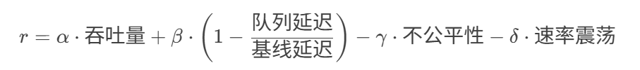

# 2025/4/19

BBR 前, 主流的 TCP 拥塞控制算法都以数据包丢失 (loss-based) 作为网络拥塞的信号, 这种不太合理的 "等价" 最早可以追溯到 1980s 到 1990s，当时的链路容量和缓冲区容量分别以 Mbps 和 KB 计, 参考现在的标准, 链路质量可以说很差

三四十年后, 这两个物理容量已经增长了 5 到 6 个数量级, 例如数据中心网络带宽可达到 100Gpbs 及以上, 现代 infra 中, 丢包和延迟不一定代表网络拥塞, 还有可能是:

## 丢包的其他可能原因

### 物理层或链路层错误

1. 无线网络中的信号干扰, 信号衰减或信道竞争, 可能导致数据包丢失
2. 光纤的物理损坏, 电磁干扰等也可能导致比特错误, 数据包丢失

### 网络设备的主动策略

1. 路由器或交换机可能根据 QoS (服务质量) 策略, 流量整形 (Traffic Shaping), 或终端设备流量限速, 主动丢弃部分数据包 (低优先级流量)
2. ECN (显式拥塞通知) 未开启, 即使网络不拥塞, 设备可能因为不支持 ECN 直接丢弃数据包

ECN 是一种网络拥塞控制机制, 允许网络设备 (例如路由器) 在即将发生拥塞时, 通过标记数据包的方式主动通知发送端和接收端, 从而避免通过丢包隐式传递拥塞信号

ECN 是对传统拥塞控制机制 (例如 Cubic 根据丢包判断拥塞) 的重要改进

路由器检测到网络即将拥塞, 例如队列长度超过阈值, 不直接丢弃数据包, 而是在数据包的 IP 头设置一个拥塞标记 (Congestion Experienced, CE), 继续转发该数据包

### 中间链路的不稳定性

- 移动网络中基站切换 (Handover) 可能导致短暂丢包
- 卫星链路由于长距离和高误码率容易丢包

### 协议栈问题

- 协议栈的 bug (例如内核缓冲区错误)
- NAT 超时或防火墙规则 (例如会话超时后丢弃数据包)

## 延迟增加的其他可能原因

### 非拥塞性数据包排队延迟

- 网络设备的短暂缓冲区堆积 (例如突发流量), 而不是网络本身拥塞
- 接收端处理能力不足 (例如 CPU 过载), 导致 ACK 延迟, 而不是网络本身拥塞

### 路由改变

动态路由协议 (例如 BGP、OSPF) 导致路径切换, 新路径可能有更高的传播延迟 (例如经过更远的节点)

### 协议处理开销

- TLS 加密, gzip 压缩或深度包检测 (DPI) 等操作增加处理延迟
- 代理服务器或 CDN 节点的额外处理

### 流量调度策略

路由器或交换机可能根据 QoS (服务质量) 策略, 流量整形 (Traffic Shaping), 或终端设备流量限速, 导致延迟增加 (低优先级流量)

### 终端设备问题

- 发送方或接收方的操作系统调度延迟 (例如 CPU 资源竞争)
- 虚拟机环境中的 Hypervisor 调度抖动

TCP 基于丢包的拥塞控制 (loss-based congestion control)

- 链路瓶颈处的 buffer 很大时, 这类算法会持续占满整个缓冲区, 导致 buffer-bloat 缓冲区膨胀
- 链路瓶颈处的 buffer 很小时, 这类算法错误的将丢包作为拥塞信号, 导致吞吐量很低

## BBR 如何应对这些问题

对于一个 (全双工) TCP 连接, 在任意时刻, 每个方向都有且只有一段最慢的链路, 称为瓶颈 (bottleneck)

- 瓶颈决定 TCP 连接的最大数据传输速率, 这是不可压缩流 (incompressible flow) 的特性
- 瓶颈也是持久队列 (persistent queues) 形成的地点

对于一条链路, 只有当数据包离开速率 (departure rate) 大于到达速率 (arrival rate) 时, 队列才会收缩; 一条运行在最大传输速率的连接, 除瓶颈外的地方都有更大的离开速率, 所以队列通常在瓶颈处堆积

> 两个物理特性决定了链路的性能

- RTprop (round-trip propagation time) 往返传输时间
- BtlBw (bottleneck bandwidth) 瓶颈带宽

如果链路是一条物理管道, 则 RTprop 是管道的长度, BtlBw 是管道最细处的横截面积

### RTprop/BtlBw 和 inflight 传输中的数据量之间的关系

BBR 的核心思想是主动探测带宽和 RTT, 而不是将丢包或延迟作为拥塞信号, 丢包或延迟抖动时, 优先基于带宽和 RTT 调整发送速率, 而不是立即降速

### BBR 的核心目标

BBR 的核心目标是让发送速率尽可能接近网络的物理极限 (即瓶颈带宽 × 传播延迟), 将正在传输中的数据量 (inflight data) 控制在 BDP 附近, 避免超过网络容量导致数据包排队甚至丢失

网络最大容量的理论值 BDP = BtlBw x RTprop

BBR 通过 **RTT** 和确认包 (ACK) 中的 **已发送字节数**, 计算传输速率 (delivery rate), 维护当前路径的**最大**传输速率作为网络的瓶颈带宽 (BtlBw), 维护当前路径的**最小** RTT 作为网络的传播延迟 RTprop

### `delivery rate = Δdelivered / Δt`

BtlBw 的测量: 一段时间内的最大 `delivery rate = Δdelivered / Δt`, 就是该时间段内这条链路的 BtlBw 瓶颈带宽

- Δdelivered: 两个 ACK 间新确认的字节数
- Δt: 两个 ACK 到达的时间间隔

RTprop 的测量: 一段时间内的最小 RTT, 就是该时间段内这条链路的 RTprop 往返传输延迟

结合论文中的图

- 以前 (瓶颈链路的) 缓冲区较小, 基于丢包的拥塞控制导致的额外延迟较小
- 现在缓冲区通常较大, 导致 buffer-bloat 导致的额外延迟已经是秒级, 不再是毫秒级
- 有人证明了 BDP 点是最优的, 可以最大化吞吐量, 最小化延迟和丢包率; 同时又有人证明了不存在可以收敛到 BDP 点的算法
- 一条连接满足以下两个条件时, 将运行在最大吞吐量和最低延迟
  - 速率平衡 (rate balance): 瓶颈链路的数据包到达速率等于瓶颈带宽 BtlBw
  - 管道填满 (full pipe): 传输中的总数据 (inflight) 等于 BDP (= BtlBw × RTprop)

速率平衡不能保证收敛到 BDP 点: 如果某个 BDP=5 的链路上, 开始时发送了 10 个包组成的 initial window, 此后稳定运行在瓶颈速率上, 那么缓冲区将稳定有 5 个数据包的队列, 无法排空

下面是 ns3 的代码

```cpp
// tcb: tcp 控制块
void TcpBbr::UpdateRTprop(Ptr<TcpSocketState> tcb) {
  NS_LOG_FUNCTION(this << tcb);
  // 检查当前时间是否超过上一次更新最小 rtt 的时间 + 过滤窗口长度 (m_minRttFilterLen, 通常是 10s)
  // BBR 周期性的 (通常是 10s) 探测最小 rtt
  m_minRttExpired = Simulator::Now() > (m_minRttStamp + m_minRttFilterLen);
  // 如果当前 RTT 是正值, 且 <= 历史最小 RTT，则更新 RTprop
  // 如果当前 RTT 是正值, 且历史最小 RTT 已过期, 则也强制更新 RTprop
  if (tcb->m_lastRtt.Get().IsPositive() && (tcb->m_lastRtt <= m_minRtt || m_minRttExpired)) {
    m_minRtt = tcb->m_lastRtt;
    m_minRttStamp = Simulator::Now();
  }
}
```

```cpp
// tcb: tcp 控制块
void TcpBbr::UpdateBottleneckBandwidth(Ptr<TcpSocketState> tcb, const TcpRateOps::TcpRateSample& rs) {
  NS_LOG_FUNCTION(this << tcb << rs);
  // 交付数据量为负或时间间隔为 0 时, 直接返回
  if (rs.m_delivered < 0 || rs.m_interval.IsZero()) {
    return;
  }
  // 更新轮次计数 (Round Counting)
  UpdateRound(tcb, rs);
  // 如果当前速率 >= 历史最大速率, 则更新 BtlBw
  // 或者不是应用受限, 则也强制更新 BtlBw
  if (rs.m_deliveryRate >= m_maxBwFilter.GetBest() || !rs.m_isAppLimited) {
    m_maxBwFilter.Update(rs.m_deliveryRate, m_roundCount);
  }
}
```

### TCP Pacing (在每个 RTT 窗口内均匀发送数据包)

为了使得瓶颈链路的数据包到达速率 (arrival rate) 匹配数据包离开速率 (departure rate), BBR 会对每个数据包进行 pace (在每个 RTT 窗口内均匀发送数据包)

在 ProbeBW 阶段, 周期性使用 pacingGain=1.25 (向上探测) 和 pacingGain=0.75 (向下收敛), 目的是判断 BtlBw 是否有**增加**

```cpp
const double TcpBbr::PACING_GAIN_CYCLE[] = {5.0 / 4, 3.0 / 4, 1, 1, 1, 1, 1, 1};

void TcpBbr::AdvanceCyclePhase() {
  NS_LOG_FUNCTION(this);
  m_cycleStamp = Simulator::Now();
  m_cycleIndex = (m_cycleIndex + 1) % GAIN_CYCLE_LENGTH; // 8
  m_pacingGain = PACING_GAIN_CYCLE[m_cycleIndex];
}
```

- 如果 BtlBw 不变: delivery rate 不变, 1.25 后队列积压, 0.75 后队列耗尽
- 如果 BtlBw 增大: delivery rate 增大, 新的 delivery rate 最大值会更新 BBR 对 BtlBw 的估算值, 进而增大基础 pacing rate

# 2025/04/23

## BBR 状态机

```cpp
const char* const TcpBbr::BbrModeName[BBR_PROBE_RTT + 1] = {
  "BBR_STARTUP", // 连接启动时
  "BBR_DRAIN", //
  "BBR_PROBE_BW",
  "BBR_PROBE_RTT",
};
```

- Startup 阶段: 为了处理跨 12 个数量级的网络带宽, Startup 阶段使用使用 2/ln2 的增益, 指数增大发送速率, 可以在 logBDP 个 rtt 内探测到 bdp, 但是最多导致 (2/ln2 - 1), 约等于 2 个 bdp 的积压 (startup queue), 探测到 BtlBw 后, 转到 Drain 阶段
- Drain 阶段: 使用 ln2/2 的增益减小发送速率, 排空 Startup 阶段的积压 (startup queue)
- ProbeBW 阶段: 稳态行为
- ProbeRTT 阶段: 最小 rtt 周期内 (10s) 未更新, 或 bdp 显著下降时, 进入 ProbeRTT 阶段, bbr 使用极低的发送速率 (默认 1p/rtt) 排空瓶颈缓冲区的积压, 测量并更新最小 rtt

```sh
// net/ipv4/tcp_bbr.c

         |
         V
+---> STARTUP  ----+
|        |         |
|        V         |
|      DRAIN   ----+
|        |         |
|        V         |
+---> PROBE_BW ----+
|      ^    |      |
|      |    |      |
|      +----+      |
|                  |
+---- PROBE_RTT <--+
```

## BBR 论文中提出的问题

> 蜂窝网络中的自适应带宽

蜂窝网络根据每个用户的数据包排队 (queue of packets) 情况调整每个用户的带宽 (adapt per-subscriber bandwidth)
BBRv1 产生非常小的队列, 导致在低速情况下连接卡顿 (stuck at low rates), 增大峰值 ProbeBW pacingGain 以产生较大的队列，会使得卡住的情况大大减少，这暗示较大的队列对于某些网络不是坏事

> 延迟和聚合 ACK

蜂窝网络, 无线网络和有线宽带网络经常会延迟和聚合 ACK (delay and aggregate) 当 inflight 限制到单个 BDP 时, 会导致因为数据量太少而导致卡顿
将 ProbeBW cwndGain 增大到 2, 使得 BBR 可以在估算的传输速率上持续平稳发送, 即使 ACK 被延迟了一个 RTT, 显著避免了卡顿

## 基于强化学习的 bbr 参数优化

思路参考 Accelerating Loss Recovery for Content Delivery Network

bbr 通过估算瓶颈带宽 BtlBw (传输速率的最大值) 和往返传播时间 (RTprop) 动态调整发送速率

bbr 的参数, 例如最小 rtt 的探测周期, pacingGain, cwndGain 通常是静态或半静态的

1. 现有的解决方案大多数是静态的使用固定值调整 bbr 的参数 (某事件发生时, 调整一个固定值), 难以适应复杂的网络环境, 例如无线网络中多用户接入时, 剧烈的带宽波动
2. 固定的参数, 也难以保证多个 tcp 流竞争时的公平性

强化学习的核心是通过试错学习最优策略, 使用 RL 优化 bbr 参数, 关键包括

1. 状态 (State) 定义

- 网络状态
  - 实时测量的 BtlBw, RTprop
  - 队列排队延迟 (通过 rtt 变化推断?)
  - 丢包率
  - 链路利用率 (发送速率 / BtlBw)
- 流状态
  - 当前的发送速率 (ns3 pacingRate), 拥塞窗口 cwnd
  - rtt 变化趋势
- 环境特征
  - 网络特征: 有线/无线
  - 竞争的 tcp 流的数量 (通过 ack 间隔推断?)

2. 动作 (Action) 空间

   - 离散动作, 使用 DQN 强化学习算法: 微调 pacingGain 和 cwndGain 增益系数, 从预定义集合中选择, 例如 `{0.5, 0.75, 1.0, 1.25, 1.5}`
   - 连续动作, 使用 PPO 强化学习算法: 微调 pacingGain 和 cwndGain 增益系数, 从某个范围中选择, 例如 pacingGain `[0.5, 2.0]`, cwndGain `[1.0, 3.0]`

3. 奖励函数

设计多目标奖励函数 (AI 生成)



- 吞吐量: 单位时间内传输的数据量
- 队列延迟: 通过 RTT - RTprop 估算
- 不公平性: 流场景下使用 Jain 公平指数惩罚
- 速率震荡: 惩罚发送速率的方差 (保证平滑性)

### 强化学习算法选择

- DQN: 适用于离散动作空间, 实现简单, 适合初步验证
- PPO: 适用于连续动作空间, 实现复杂, 调整参数更灵活
